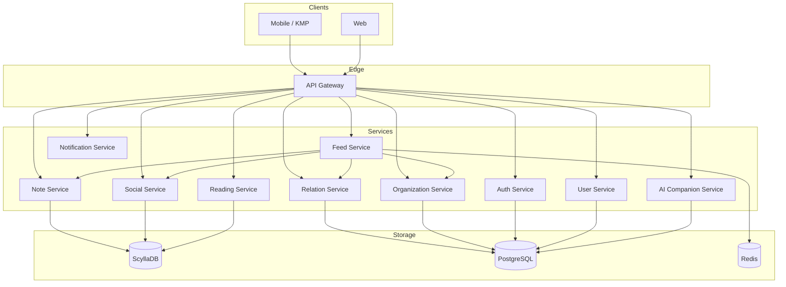
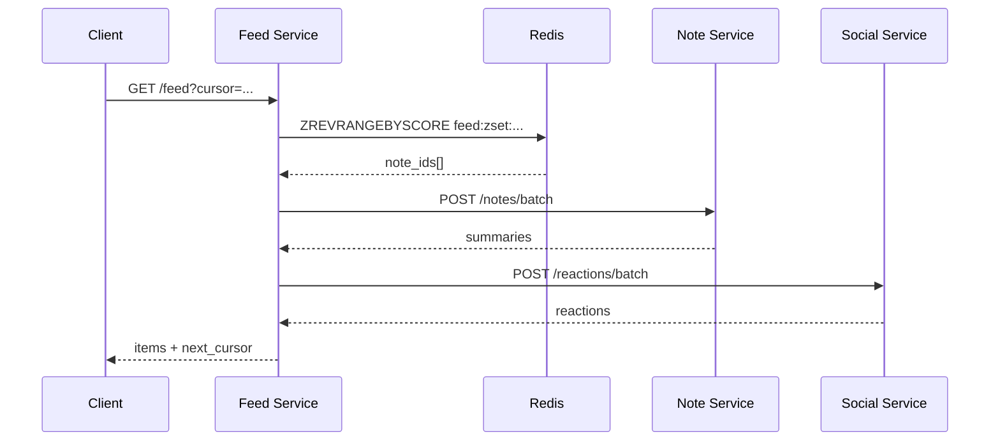
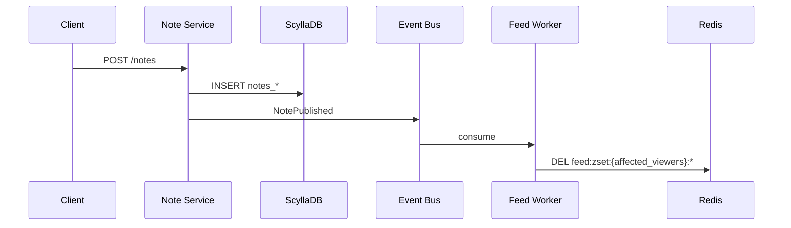

# BibleLog 백엔드 아키텍처

| | |
|---|---|
| **문서 버전** | 1.3 |
| **작성일** | 2026-07-09 |
| **관련 문서** | [project_definition.md](./project_definition.md), [openapi/biblelog-api.yaml](./openapi/biblelog-api.yaml) |

---

## 1. 개요

BibleLog는 성경 읽기 습관 형성과 신앙 공동체 SNS를 결합한 서비스다. 백엔드는 **물리적으로 분리된 마이크로서비스**로 구성하며, **Traefik**이 단일 API 엔드포인트(`http://localhost:8000`)로 라우팅한다.

### 1.0 Monorepo 레이아웃 (`backend/`)

```
backend/
├── traefik/              # API Gateway — Traefik dynamic routing
├── common/               # 공통: config, models, domain, db clients, Kafka events, JWT, contracts
├── user_service/         # Auth, Users, Relation (PostgreSQL)
├── note_service/         # Journal API, Note CRUD (ScyllaDB)
├── feed_service/         # Feed API, Redis ZSET cache, cursor pagination
├── social_service/       # Reactions, comments (ScyllaDB) — Feed에서 호출
├── reading_service/      # Reading records, stats (ScyllaDB)
├── ai_service/           # AI companion (PostgreSQL + LLM)
├── schema/               # scylla.cql, postgres.sql
├── docker-compose.yml    # Traefik + infra + all services
└── */Dockerfile          # per-service container images
```

| 패키지 | HTTP prefix | 포트 | 독립 저장소 |
|--------|-------------|------|-------------|
| `traefik` | (라우팅) | 8000 (API), 8090 (dashboard) | — |
| `user_service` | `/auth`, `/users` | 8001 | PostgreSQL |
| `note_service` | `/journal` | 8002 | ScyllaDB |
| `social_service` | `/internal/*` | 8003 | ScyllaDB |
| `feed_service` | `/feed` | 8004 | Redis |
| `reading_service` | `/reading` | 8005 | ScyllaDB |
| `ai_service` | `/ai` | 8006 | PostgreSQL |

**Traefik 역할:** 클라이언트는 `http://localhost:8000` 단일 URL을 사용한다. path prefix 기반으로 각 서비스에 프록시한다. `/internal/*`는 public 라우트에 포함하지 않는다.

서비스 간 통신은 `common/clients/` HTTP 클라이언트 + `/internal/*` API(`X-Internal-Token`)를 사용한다. 캐시 무효화는 **Kafka** 이벤트 버스(`biblelog.events`)로 처리한다.

### 1.3 Docker Compose 배포

```bash
cd backend && docker compose up --build
```

`docker-compose.yml`은 Traefik, ScyllaDB, Redis, PostgreSQL, 6개 애플리케이션 서비스를 함께 기동한다.

**Traefik 라우팅** (`traefik/dynamic/routes.yml`):

| Path | Upstream |
|------|----------|
| `/auth`, `/users` | user-service:8001 |
| `/journal` | note-service:8002 |
| `/feed` | feed-service:8004 |
| `/reading` | reading-service:8005 |
| `/ai` | ai-service:8006 |

**내부 API (서비스 간, Traefik 미노출):**

| 서비스 | 엔드포인트 예시 |
|--------|----------------|
| User | `GET /internal/users/{id}`, `GET /internal/relations/friends/{id}` |
| Note | `POST /internal/notes/batch`, `POST /internal/notes/recent-for-feed` |
| Social | `POST /internal/reactions/batch`, `POST /internal/reactions/{id}/toggle` |
| Feed | `POST /internal/cache/invalidate-all` |

인증: `X-Internal-Token` 헤더 (`INTERNAL_SERVICE_TOKEN` 환경 변수).

### 1.1 핵심 설계 원칙

| 원칙 | 설명 |
|------|------|
| **Note = Source of Truth** | 묵상 노트 원본은 Note Service + ScyllaDB에만 저장한다. |
| **Feed = 조립 레이어** | Feed Service는 타임라인을 DB에 materialize하지 않는다. Redis의 `note_id` 목록을 기반으로 응답을 조립한다. |
| **Redis는 ID만** | 피드 캐시에 노트 본문을 넣지 않는다. `note_id` + cursor 메타데이터만 저장한다. |
| **상세는 요청 시** | 피드 카드는 요약(excerpt), 상세 화면은 Note Service에서 전문을 조회한다. |
| **Cursor pagination** | offset 기반 페이지네이션을 사용하지 않는다. `(created_at, note_id)` 복합 cursor로 안정적인 무한 스크롤을 지원한다. |

### 1.2 기술 스택 요약

| 계층 | 기술 |
|------|------|
| API Gateway / BFF | **Traefik** (docker-compose) |
| 서비스 런타임 | Python (FastAPI) — 현재 backend 기준 |
| 주 저장소 (콘텐츠·소셜) | **ScyllaDB** |
| 관계·조직 | **PostgreSQL** |
| Hot cache | **Redis** (Sorted Set, String) |
| 이벤트 버스 | Kafka / NATS (Phase 2+) |
| AI | 외부 LLM API (OpenAI, Anthropic) |

---

## 2. 서비스 맵



### 2.1 서비스별 책임

| 서비스 | 책임 | 저장소 |
|--------|------|--------|
| **Auth** | OAuth, JWT 발급·갱신, dev login | PostgreSQL |
| **User** | 프로필 CRUD | PostgreSQL |
| **Note** | 묵상 노트 CRUD, 검색, 권한 검증, batch 조회 | ScyllaDB |
| **Feed** | 피드 조립, cursor pagination, Redis 캐시 관리 | Redis (+ Note/Social/Relation/Org 호출) |
| **Social** | 댓글, 리액션, 카운트 batch API | ScyllaDB, Redis |
| **Reading** | 성경 읽기 기록, Streak, 진행률 | ScyllaDB, Redis |
| **Relation** | 친구 요청·수락·목록 | PostgreSQL |
| **Organization** | 교회, 소그룹, 멤버십, 역할 | PostgreSQL |
| **Notification** | 인앱·푸시 알림 | ScyllaDB, Redis |
| **AI Companion** | 영적 동반자 대화 | PostgreSQL, 외부 LLM |

> **Feed Service는 ScyllaDB 타임라인 테이블을 갖지 않는다.** 피드에 노출할 `note_id` 순서는 Redis Sorted Set에 캐시하고, cache miss 시 Note Service 데이터를 read-time에 조립한다.

---

## 3. Note Service (ScyllaDB)

묵상 노트의 유일한 원본(Source of Truth)이다.

### 3.1 테이블 설계

```cql
-- 작성자별 노트 목록 (내 노트, author-centric read)
CREATE TABLE notes_by_author (
    author_id    UUID,
    created_at   TIMESTAMP,
    note_id      UUID,
    content      TEXT,
    prayer_topic TEXT,
    emotion      TEXT,
    visibility   TEXT,       -- public | friends | small_group | church | private
    church_id    UUID,
    group_ids    SET<UUID>,
    reference    TEXT,       -- BibleReference JSON
    updated_at   TIMESTAMP,
    deleted_at   TIMESTAMP,
    PRIMARY KEY ((author_id), created_at, note_id)
) WITH CLUSTERING ORDER BY (created_at DESC, note_id DESC);

-- note_id 단건·batch 조회
CREATE TABLE notes_by_id (
    note_id      UUID PRIMARY KEY,
    author_id    UUID,
    created_at   TIMESTAMP,
    content      TEXT,
    prayer_topic TEXT,
    emotion      TEXT,
    visibility   TEXT,
    church_id    UUID,
    group_ids    SET<UUID>,
    reference    TEXT,
    updated_at   TIMESTAMP,
    deleted_at   TIMESTAMP
);

-- public 노트 시간순 조회 (피드 조립 보조)
CREATE TABLE notes_by_visibility (
    visibility   TEXT,
    bucket       TEXT,       -- 'YYYY-MM' — 파티션 unbounded 방지
    created_at   TIMESTAMP,
    note_id      UUID,
    author_id    UUID,
    PRIMARY KEY ((visibility, bucket), created_at, note_id)
) WITH CLUSTERING ORDER BY (created_at DESC, note_id DESC);
```

### 3.2 쓰기 규칙

- 노트 생성: `notes_by_author`, `notes_by_id`, (visibility ≠ private이면) `notes_by_visibility` 동시 write
- 노트 수정: 위 테이블 upsert. `NoteUpdated` 이벤트 발행 → Feed Redis 캐시 무효화
- 노트 삭제: soft delete (`deleted_at` 설정). `NoteDeleted` 이벤트 → Feed/Social 정리

### 3.3 API

| Method | Path | 설명 |
|--------|------|------|
| `POST` | `/notes` | 노트 작성 |
| `PATCH` | `/notes/{id}` | 노트 수정 |
| `DELETE` | `/notes/{id}` | 노트 삭제 |
| `GET` | `/notes/{id}` | 상세 조회 (권한 검증) |
| `GET` | `/notes/mine` | 내 노트 목록 (cursor pagination) |
| `POST` | `/notes/batch` | `note_ids[]` → 요약 일괄 조회 (Feed enrichment) |
| `POST` | `/notes/recent-by-authors` | Feed 조립용 — author별 최근 노트 |

#### `POST /notes/batch` (Feed Service → Note Service)

```json
// Request
{
  "note_ids": ["uuid-1", "uuid-2"],
  "viewer_id": "current-user-uuid"
}

// Response — 권한 없는 note_id는 제외
{
  "notes": [
    {
      "id": "uuid-1",
      "author_id": "...",
      "author_name": "김신앙",
      "excerpt": "오늘 요한복음 3:16을 읽으며...",
      "visibility": "small_group",
      "emotion": "gratitude",
      "reference": { "book_id": 43, "start_chapter": 3, "start_verse": 16 },
      "created_at": "2026-07-09T06:00:00Z"
    }
  ]
}
```

`excerpt`는 본문 앞 ~120자. 전문은 `GET /notes/{id}`에서만 반환한다.

#### `POST /notes/recent-by-authors` (Feed cache miss 시)

```json
// Request
{
  "author_ids": ["uuid-a", "uuid-b"],
  "viewer_id": "current-user-uuid",
  "since": "2026-06-09T00:00:00Z",
  "limit_per_author": 10
}

// Response
{
  "entries": [
    { "note_id": "...", "author_id": "...", "created_at": "...", "visibility": "friends" }
  ]
}
```

---

## 4. Feed Service

피드를 **빠르고 일관되게** 보여주는 조립 레이어다. 타임라인을 ScyllaDB에 저장하지 않는다.

### 4.1 데이터 흐름

```
GET /feed
  │
  ├─ 1. Redis Sorted Set에서 cursor 기준 note_id 페이지 조회
  │      HIT → note_ids
  │
  ├─ 2. MISS → read-time 조립
  │      a. Relation / Organization → 대상 author_ids
  │      b. Note Service → recent-by-authors + public notes
  │      c. visibility · 멤버십 필터
  │      d. created_at DESC 정렬
  │      e. Redis Sorted Set에 전체 결과 적재 (TTL)
  │
  ├─ 3. cursor 기준으로 limit+1개 note_id 슬라이스
  │
  ├─ 4. Note Service POST /notes/batch → summaries
  ├─ 5. Social Service POST /reactions/batch, /comments/count/batch
  │
  └─ 6. FeedItem[] + next_cursor 반환
```

### 4.2 Redis — Sorted Set 기반 피드 캐시

노트 본문이 아닌 **`note_id`만** 저장한다. 정렬과 cursor pagination에 Sorted Set을 사용한다.

```
키:   feed:zset:{viewer_id}:{filter}:{sort}

멤버: note_id (UUID string)
점수: latest → created_at을 Unix μs (또는 ms) 로 변환
      popular → score = f(reactions, comments, time_decay)

TTL:  60s (latest), 300s (popular)
```

| 키 패턴 | 용도 | TTL |
|---------|------|-----|
| `feed:zset:{viewer_id}:{filter}:latest` | 최신순 피드 ID 목록 | 60s |
| `feed:zset:{viewer_id}:{filter}:popular` | 인기순 피드 ID 목록 | 300s |
| `note:summary:{note_id}` | Note batch miss 시 개별 요약 캐시 | 5~30min |

`filter`: `all` | `friends` | `small_group` | `church` (현재 OpenAPI `FeedFilter`와 동일)

### 4.3 Cursor-based Pagination

offset(`?page=2`)은 **사용하지 않는다.** 삽입·삭제 시 중복·누락이 발생하기 때문이다.

#### Cursor 형식

```
cursor = base64url( "{created_at_iso}|{note_id}" )

예: 2026-07-09T06:00:00.123456Z|550e8400-e29b-41d4-a716-446655440000
```

- 첫 페이지: `cursor` 생략 (또는 `null`)
- 다음 페이지: 이전 응답의 `next_cursor` 전달

#### 조회 알고리즘 (Redis HIT)

```
1. ZREVRANGE feed:zset:{key} 0 -1 WITHSCORES  → 전체 (캐시 적재 직후) 또는
   ZREVRANGEBYSCORE key (cursor_score - ε) -inf LIMIT (limit + 1)

2. limit+1개 조회 → limit개 반환, 남은 1개로 next_cursor 생성

3. has_more = (반환 개수 == limit+1에서 pop한 경우)
```

`created_at`이 동일한 노트가 여러 개일 때를 위해 **tie-breaker로 `note_id`를 함께 사용**한다.

정렬 키: `(created_at DESC, note_id DESC)`

#### 조회 알고리즘 (Redis MISS — 조립)

```
1. author_ids 수집
   - filter=all    → 친구 + 소그룹 멤버 + 교회 멤버 + public
   - filter=friends → Relation Service
   - filter=small_group → Organization Service
   - filter=church  → Organization Service

2. Note Service POST /notes/recent-by-authors
   + notes_by_visibility (public) 조회

3. viewer 기준 visibility 필터
   - private → 제외
   - friends → 친구만
   - small_group → 같은 group_ids 교집합
   - church → 같은 church_id

4. (created_at DESC, note_id DESC) 정렬

5. Redis pipeline:
   ZADD feed:zset:{key} score note_id  (각 entry)
   EXPIRE feed:zset:{key} TTL

6. cursor 로직으로 limit+1 슬라이스
```

#### API

```
GET /feed?filter=all&sort=latest&limit=20&cursor={optional}
```

```json
// Response
{
  "items": [
    {
      "note": {
        "id": "uuid-1",
        "excerpt": "오늘 요한복음을 읽으며...",
        "author_id": "...",
        "author_name": "김신앙",
        "visibility": "small_group",
        "emotion": "gratitude",
        "created_at": "2026-07-09T06:00:00Z"
      },
      "reactions": [
        { "type": "empathy", "count": 5, "reacted_by_me": true }
      ],
      "comment_count": 3
    }
  ],
  "next_cursor": "MjAyNi0wNy0wOVQwNjowMDowMC4xMjM0NTZaNTUwZTg0MDAtZTI5Yi00MWQ0LWE3MTYtNDQ2NjU1NDQwMDAw",
  "has_more": true
}
```

`items` 내 `note` 순서는 **반드시 timeline 순서**(cursor 기준)를 유지한다.

### 4.4 캐시 무효화

| 이벤트 | 동작 |
|--------|------|
| `NotePublished` | 해당 viewer에게 노출되는 `feed:zset:{viewer_id}:*` DEL |
| `NoteUpdated` | 동일 + `note:summary:{note_id}` DEL |
| `NoteDeleted` | ZREM `note_id` from 관련 zsets + summary DEL |
| `FriendshipAccepted` | 양쪽 viewer의 friends/all zset DEL |
| `GroupMembershipChanged` | 해당 그룹·멤버 zset DEL |

전체 무효화(`DEL feed:zset:{viewer_id}:*`)는 단순하고 안전하다. TTL이 짧아(60s) 부담이 적다.

### 4.5 인기순 (`sort=popular`)

최신순과 동일한 Redis Sorted Set 패턴을 쓰되, score를 아래처럼 계산한다.

```
score = (reaction_count * 2) + (comment_count * 3) + time_decay(created_at)

time_decay = 1 / (1 + hours_since_post / 24)
```

`ReactionToggled`, `CommentCreated` 이벤트 시 해당 `note_id`의 score를 `ZINCRBY`로 갱신하거나, zset 전체를 invalidate한다.

---

## 5. Social Service (ScyllaDB)

```cql
CREATE TABLE reactions_by_note (
    note_id       UUID,
    user_id       UUID,
    reaction_type TEXT,
    created_at    TIMESTAMP,
    PRIMARY KEY (note_id, user_id)
);

CREATE TABLE reaction_counts (
    note_id       UUID,
    reaction_type TEXT,
    count         COUNTER,
    PRIMARY KEY (note_id, reaction_type)
);

CREATE TABLE comments_by_note (
    note_id       UUID,
    created_at    TIMESTAMP,
    comment_id    UUID,
    author_id     UUID,
    content       TEXT,
    PRIMARY KEY (note_id, created_at, comment_id)
) WITH CLUSTERING ORDER BY (created_at ASC, comment_id ASC);
```

### Redis (Social)

| 키 | 값 |
|----|-----|
| `reactions:{note_id}` | `{ "empathy": 5, "amen": 2, ... }` |
| `comments:count:{note_id}` | integer |

### Batch API (Feed enrichment)

```
POST /reactions/batch    { "note_ids": [...], "viewer_id": "..." }
POST /comments/count/batch  { "note_ids": [...] }
```

---

## 6. Relation & Organization (PostgreSQL)

친구 관계, 교회·소그룹 멤버십은 트랜잭션·조인이 필요해 PostgreSQL을 사용한다.

### Relation Service

- 친구 요청 / 수락 / 거절 / 삭제
- `GET /friends` → Feed 조립 시 `author_ids` 제공

### Organization Service

- 교회, 소그룹 CRUD
- 멤버 추가·제거, 리더 지정
- `GET /memberships/{user_id}` → group_ids, church_id 목록

Feed Service는 피드 조립 전에 이 서비스들을 호출해 **노출 대상 author 집합**을 구한다.

---

## 7. Reading Service (ScyllaDB)

개인 읽기 기록·Streak·진행률. Note/Feed와 독립적으로 스케일한다.

```cql
CREATE TABLE reading_records_by_user (
    user_id      UUID,
    date         DATE,
    record_id    UUID,
    book_id      SMALLINT,
    start_chapter SMALLINT,
    start_verse  SMALLINT,
    end_chapter  SMALLINT,
    end_verse    SMALLINT,
    minutes_read INT,
    created_at   TIMESTAMP,
    PRIMARY KEY ((user_id), date, record_id)
) WITH CLUSTERING ORDER BY (date DESC, record_id DESC);
```

Redis: `reading:stats:{user_id}` — Streak, 진행률 캐시 (TTL 5~15min)

---

## 8. 이벤트 (비동기 연동)

서비스 간 동기 호출을 줄이고, 캐시 무효화·알림·인기순 갱신은 이벤트로 처리한다.

| 이벤트 | 발행 | 구독 |
|--------|------|------|
| `NotePublished` | Note | Feed (cache inv), Notify |
| `NoteUpdated` | Note | Feed (cache inv) |
| `NoteDeleted` | Note | Feed, Social |
| `ReactionToggled` | Social | Feed (popular score), Notify |
| `CommentCreated` | Social | Feed (popular score), Notify |
| `FriendshipAccepted` | Relation | Feed (cache inv), Notify |

초기(Phase 0~1)에는 앱 내부 이벤트 버스로 시작하고, Phase 2에서 Kafka/NATS로 교체한다.

---

## 9. 권한 검증 (Defense in Depth)

| 계층 | 검증 |
|------|------|
| API Gateway | JWT 검증, `viewer_id` 추출 |
| Feed Service | filter별 membership 전제 (친구·그룹·교회) |
| Note Service `/batch` | viewer별 note_id 노출 가능 여부 재검증 |
| Note Service `GET /{id}` | 상세 전문 권한 |

피드에 포함된 `note_id`라도 batch 조회 시 권한이 없으면 응답에서 제외한다.

---

## 10. 시퀀스 다이어그램

### 10.1 피드 조회 (cache hit)



### 10.2 노트 작성 → 피드 캐시 무효화



---

## 11. 저장소 역할 정리

```
┌──────────────────┬─────────────┬─────────────────────────────────────────┐
│ Service          │ Primary DB  │ Redis                                   │
├──────────────────┼─────────────┼─────────────────────────────────────────┤
│ Note             │ ScyllaDB    │ note:summary:{id}                       │
│ Feed             │ (없음)      │ feed:zset:{viewer}:{filter}:{sort}      │
│ Social           │ ScyllaDB    │ reactions:{id}, comments:count:{id}     │
│ Reading          │ ScyllaDB    │ reading:stats:{user_id}                 │
│ Relation         │ PostgreSQL  │ —                                       │
│ Organization     │ PostgreSQL  │ —                                       │
│ Auth / User      │ PostgreSQL  │ session:{jti}                           │
└──────────────────┴─────────────┴─────────────────────────────────────────┘
```

**피드 타임라인을 DB에 저장하지 않는 이유 (본 프로젝트 기준)**

- BibleLog는 친구·소그룹·교회 단위 소셜 그래프로, fan-out on write의 이점이 크지 않다.
- 노트 원본이 ScyllaDB에 있어 cache miss 시 read-time 재조립이 가능하다.
- 타임라인 materialize 시 노트 수정·삭제·visibility 변경마다 다수 row 동기화가 필요해 복잡도만 증가한다.
- Redis Sorted Set + 짧은 TTL로 읽기 성능을 확보하고, cursor pagination을 안정적으로 지원한다.

규모가 커져 피드 조회 p99가 200ms를 넘기고, 유저당 팔로우가 500+에 달하면 `user_feed` materialize 도입을 재검토한다.

---

## 12. 구현 로드맵

| Phase | 내용 |
|-------|------|
| **0** | ✅ ScyllaDB Note, 서비스 패키지 물리 분리 |
| **1** | ✅ Feed — Redis ZSET + cursor pagination |
| **2** | ✅ Social 분리, Feed enrichment |
| **3** | ✅ Relation·Organization public APIs (친구·팔로우·교회·소그룹) |
| **4** | ✅ Traefik API Gateway, docker-compose 전체 스택 |
| **5** | ✅ Notification Service (REST + WebSocket); 인기순 score 파이프라인 고도화 예정 |
| **3.5** | ✅ JVM `:simulation` 모듈 — 다중 사용자 부하·일관성 테스트 |

### 12.1 Dual Social Graph (친구 + 팔로우)

| 모델 | 관계 | 용도 |
|------|------|------|
| **Friendship** | 상호 (요청→수락) | `visibility=friends`, `filter=friends` |
| **Follow** | 비대칭 (one-way) | 발견·`filter=following`; 친구 공개 노트 접근 **불가** |

팔로우만으로는 친구 전용 노트를 볼 수 없다. 시뮬레이션·테스트 시 visibility와 action을 일치시켜야 한다.

### 12.2 Notification Service

| 엔드포인트 | 설명 |
|-----------|------|
| `GET /notifications` | 인앱 알림 목록 |
| `WS /notifications/ws?token=<JWT>` | 실시간 이벤트 (`note_published`, `comment_created`, `reaction_toggled`, `friend_request`, `friend_accepted`, `follow`) |

Kafka 이벤트를 구독해 대상 사용자에게 REST 저장 + WebSocket push.

---

## 13. 코드베이스 매핑

| 패키지 | 주요 파일 | API |
|--------|-----------|-----|
| `traefik/` | `dynamic/routes.yml` | `:8000` (public routing) |
| `user_service/` | `routers/auth.py`, `routers/users.py`, `routers/relations.py`, `routers/organizations.py` | `/auth/*`, `/users/*`, `/friends/*`, `/follows/*`, `/churches/*`, `/small-groups/*` |
| `note_service/` | `service.py`, `router.py`, `repositories/` | `/journal/*` |
| `feed_service/` | `service.py`, `cache.py`, `cursor.py`, `router.py` | `/feed` |
| `social_service/` | `service.py`, `router.py`, `repositories/` | `/social/*`, `/internal/*` |
| `notification_service/` | `service.py`, `router.py`, `websocket_hub.py` | `/notifications`, `WS /notifications/ws` |
| `reading_service/` | `service.py`, `router.py`, `repositories/` | `/reading/*` |
| `ai_service/` | `providers.py`, `router.py` | `/ai/*` |
| `common/` | `models.py`, `config.py`, `db/`, `events/kafka_bus.py`, `contracts/` | — |

OpenAPI 계약 [`openapi/biblelog-api.yaml`](./openapi/biblelog-api.yaml). Feed 응답: `FeedPageResponse` (`items`, `next_cursor`, `has_more`).

클라이언트 진입점: Traefik `http://localhost:8000`. 각 서비스는 `uvicorn <service>.main:app`으로 독립 실행한다.

---

## 14. 변경 이력

| 버전 | 날짜 | 내용 |
|------|------|------|
| 1.4 | 2026-07-11 | Phase 3 완료 — 친구·팔로우·조직·댓글·알림 WebSocket, simulation 모듈 |
| 1.3 | 2026-07-09 | Traefik API Gateway — FastAPI gateway 제거, distributed 전용 |
| 1.2 | 2026-07-09 | Distributed 모드 — 서비스별 Dockerfile, docker-compose 전체 스택, internal HTTP API |
| 1.1 | 2026-07-09 | `backend/` monorepo — 서비스별 물리 패키지 분리, Gateway 조합 |
| 1.0 | 2026-07-09 | 초안 — Note/Feed 분리, ScyllaDB 노트, Redis ZSET 피드, cursor pagination |
